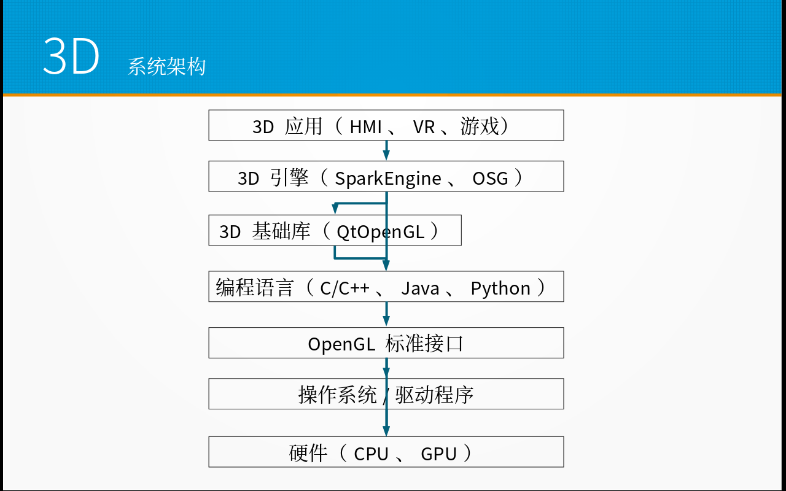
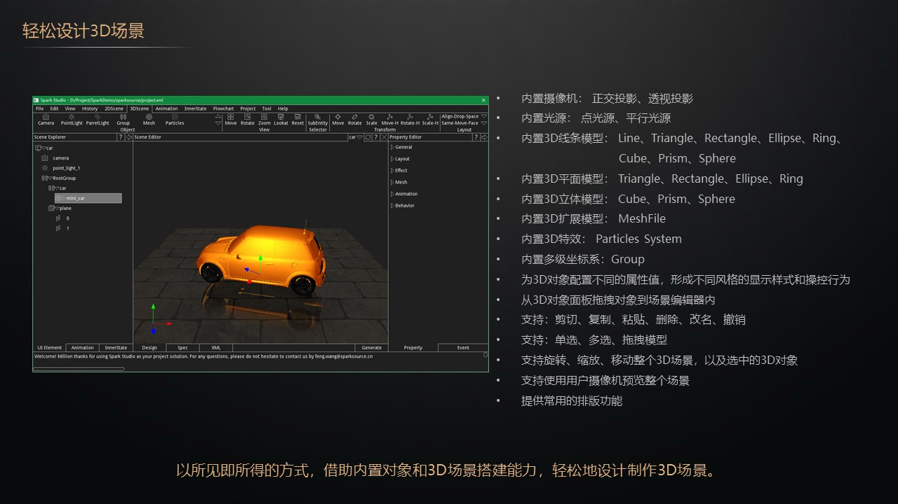

追求极致用户体验的人机界面多数都会使用 3D 技术作为应用程序的基础，3D 应用程序也
是虚拟现实（VR）的核心技术。3D 应用非常自然地拉近了计算机与人类感官的距离，因而
能够极大地提升计算机的表现力和娱乐水平，是让你的产品脱颖而出的法宝。

然而，开发 3D 应用程序是复杂程度和技术难度都比较大的一个方向。相比普通应用，它更
强调理论基础、架构设计和实现效率。除了要求开发者有扎实的数学基础和优秀的建模方法，
还需要了解硬件（显卡、GPU）和图形库的工作原理，在设计 3D 应用架构时要充分发挥
GPU 的硬件加速能力，而且具体实现要注意许多影响效率的细节，其中包括对资源的优化管
理。

SparkSource 完全自主开发的 SparkEngine 内置图形引擎，让你可以轻松设计 3D 场景。
图形引擎实际上就是指面向特定业务领域的编程平台，它提供了一类 3D 应用的大部分共性
功能，只需要编写很少量的定制代码就可以实现最终的应用。3D 应用就是要使用一种合适
的 3D 引擎高效开发。3D 系统的架构如下图所示。

SparkSource 的 3D 引擎使用 C/C++ 语言开发，直接对接 OpenGL 标准接口，充分发挥硬
件 GPU 的能力。它是为嵌入式人机交互系统，尤其是为智能网联汽车的人机交互系统，量
身定制的 3D 应用开发引擎。无论是信息娱乐系统，还是仪表系统，SparkSource 的图形引
擎都可以用非常少的代码覆盖相当大的应用场景，助你高效开发独特的 3D 应用。
SparkSource 的 3D 特性如下图所示。

有了合适的引擎，开发了想要的应用，还需要在 3D 性能优化方面做出不少的努力，因为绚
丽的应用需要很多的打磨，3D 应用尤其在资源消耗方面比普通 2D 应用高出不少。这里，
我们大概列出在 3D 应用方面性能优化的常用建议。具体的问题，需要具体分析。如有需求
请联系 SparkSource 技术支持，我们一定鼎力相助。

1. 为复杂 3D 应用配置独立的 GPU；
2. 尽可能使用硬件渲染；
3. 减少 OpenGL 的状态变化，从而减少 CPU 和驱动程序的处理时间；
4. 对图元类型优化，尽量使用效率高的图元类库，SparkSource 提供内置优化图元；
5. 对纹理资源进行优化，合理压缩纹理，尽量使用纹理缓存；
6. 尽可能使用 Shader 对渲染管线进行编程，提升渲染效率；
7. 尽可能使用多线程编程，对渲染单独一个线程，并在多核处理器上用独立的核来处理；
8. 尽可能使用异步编程，减少数据下载导致的界面响应阻塞。

短短一句话建议，可能包含开发者蹚过的好多坑。希望他们给你的 3D 应用开发带来有益的
启迪。
